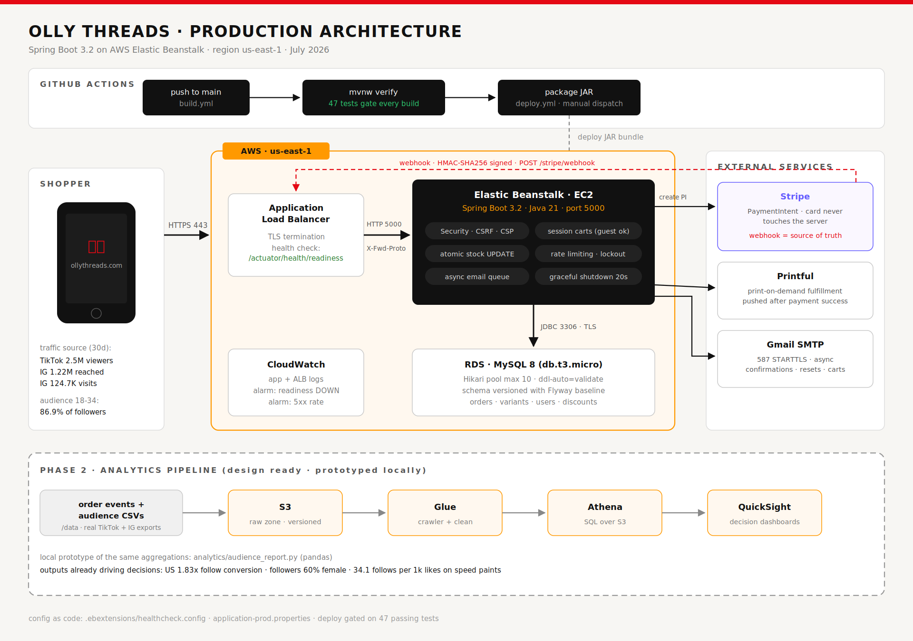
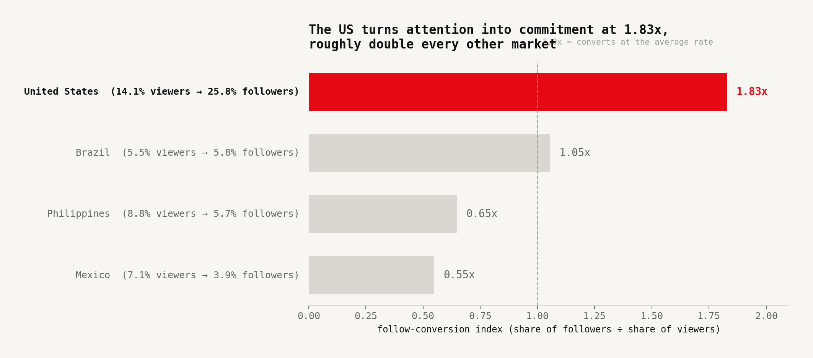
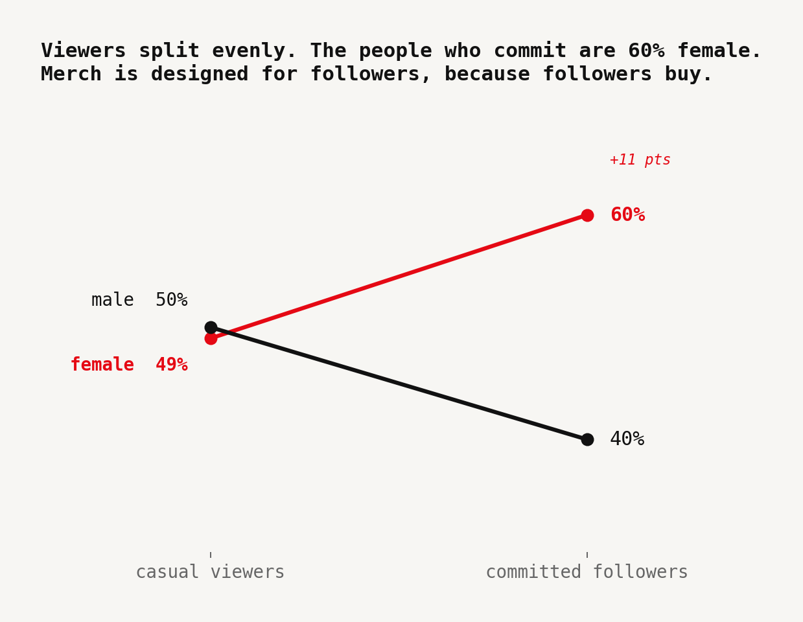
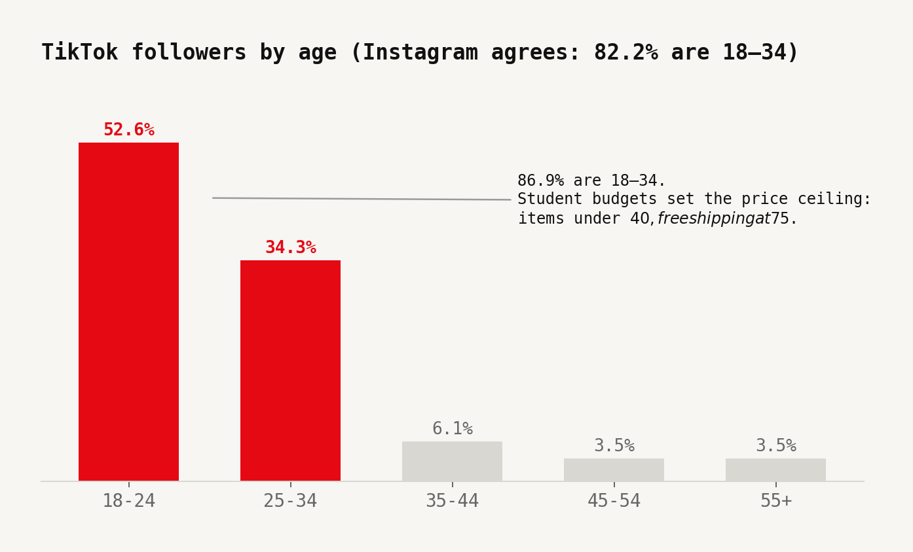
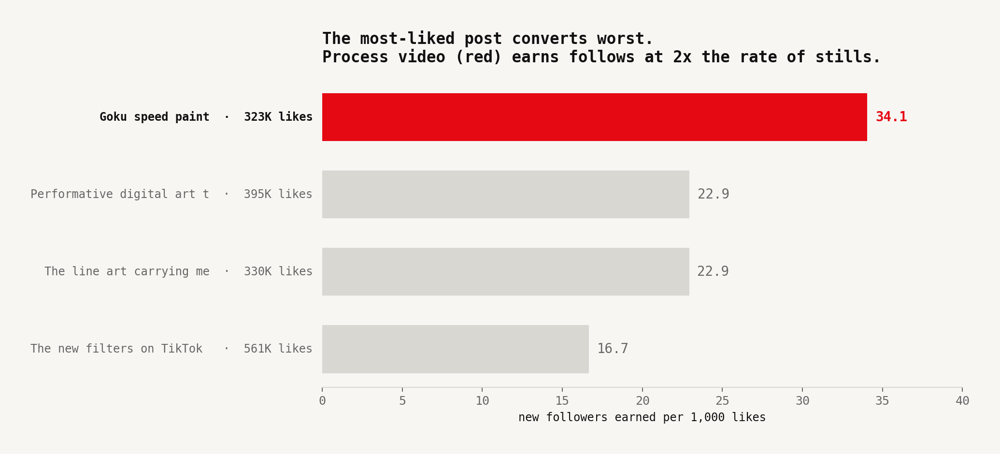

<div align="center">



# Olly Threads

**Production eCommerce platform for an anime clothing brand with 200K+ TikTok followers.**

Real Stripe payments · Printful fulfillment · AWS Elastic Beanstalk · 47 tests gating every deploy


</div>

---

## Working backward from the customer

Amazon starts with the press release. Here is this one in two sentences.

An independent anime artist turns 2.5M monthly TikTok views into direct merch revenue without surrendering 30% to a marketplace. The store survives the traffic spike a viral post causes, charges the right amount every time, and never sells a shirt it does not have.

That last clause is where most side-project stores quietly fail. This one has tests proving it does not.

---

## The data made the decisions

I exported real TikTok Analytics and Instagram Insights, cleaned them into tidy CSVs in [`/data`](data/), and wrote the aggregation logic in [`analytics/audience_report.py`](analytics/audience_report.py). Every launch decision traces to a number you can recompute:

```bash
pip install pandas matplotlib
python analytics/audience_report.py
```

<table>
<tr>
<td width="50%">

**Decision 1 — Ship to the US only at launch**

The US converts viewers to followers at **1.83×** — roughly double Brazil and triple Mexico. It holds 25.8% of followers on only 14.1% of raw views.

</td>
<td width="50%">



</td>
</tr>
<tr>
<td width="50%">

**Decision 2 — Design for followers, not viewers**

Casual viewers split 50/49 male-female. Committed followers flip to **60% female**. Followers look more like buyers than viewers do.

</td>
<td width="50%">



</td>
</tr>
<tr>
<td width="50%">

**Decision 3 — Price under $40, free shipping at $75**

**86.9%** of TikTok followers are 18–34. Student budgets are real. The $75 threshold pulls a second item into the cart instead of taxing the first.

</td>
<td width="50%">



</td>
</tr>
<tr>
<td width="50%">

**Decision 4 — Lead drops with process video**

The Goku speed paint earned **34.1 follows per 1,000 likes**. The best static post earned 16.7. Same audience, 2× the commitment per unit of attention.

</td>
<td width="50%">



</td>
</tr>
</table>

> The biggest surprise: my most-liked post (561K likes) was my worst converter. Likes are a vanity metric even within your own content. Measure the behavior you actually want. Full analysis → [`docs/DATA_DECISIONS.md`](docs/DATA_DECISIONS.md)

---

## Architecture

A request's life in this system:

Browser hits the ALB over HTTPS. The ALB terminates TLS, stamps `X-Forwarded-Proto`, and health-checks every instance at `/actuator/health` — which validates the database connection, so an instance that loses RDS is pulled from rotation automatically. Spring Boot listens on port 5000. MySQL sits behind a Hikari pool capped at 10 connections.

Money is different. **Card details never touch the app server.** The browser talks to Stripe directly. The server creates a PaymentIntent, verifies the charged amount against its own pricing math, and treats the HMAC-signed webhook as the single source of truth for "paid." Printful gets the fulfillment order only after that webhook clears. The confirmation email goes out `@Async` so a slow SMTP handshake never blocks a checkout thread.

**Estimated production cost: $20–40/month.** The ALB is the main expense and is kept intentionally — HTTPS routing, health checks, and deploy rollback options are worth it at launch. Everything else was cut.

---

## Built to not fall over

A viral post is a load test you did not schedule.

**Overselling is structurally impossible.** Stock is reserved with a conditional SQL update:

```sql
UPDATE product_variants
SET stock_qty = stock_qty - :qty
WHERE id = :id AND stock_qty >= :qty
```

Two customers racing for the last item resolve at the database, not in Java. The loser gets a clean error, never a phantom order.

**Webhooks replay. The system does not care.** Stripe redelivers events on failure. A replayed `payment_intent.succeeded` re-writes nothing. A late `payment_failed` arriving after a successful order cannot cancel it or hand inventory back. Both properties have dedicated tests.

**Prices cannot go stale mid-checkout.** All pricing logic lives in one place — `CartPricing.compute()`. The cart snapshots prices at add time, then re-reads live prices before any cent is authorized. Charge, order total, and line items always agree.

---

## Security posture

- Card data never touches the app server — Stripe owns it entirely
- BCrypt passwords (strength 10)
- CSRF via `CookieCsrfTokenRepository` — JS-readable, not HttpOnly
- Content Security Policy blocks all scripts not on the allowlist
- HSTS: 1-year max-age, includeSubDomains, preload-eligible
- Stripe webhook HMAC-SHA256 signature verification — forged fulfillment triggers are rejected
- Login lockout after 5 failures keyed by username **and** IP (`LoginAttemptService`)
- `/forgot-password` rate-limited to 5 requests per email per hour
- Cart mutations rate-limited to 30 requests per minute per IP
- Session fixation protection + 1 concurrent session per user
- SameSite=Strict on JSESSIONID
- All secrets in environment variables — nothing hardcoded, `application-local.properties` gitignored

---

## Test suite — 47 tests, no padding

```
src/test/java/com/akumathreads/
├── controller/
│   ├── CheckoutControllerPlaceOrderTest      — payment intent creation, stock reservation
│   └── StripeWebhookControllerTest           — succeeded / failed / replayed / forged webhooks
├── model/
│   └── SessionCartTest                       — cart merge, quantity update, remove
├── pricing/
│   └── CartPricingTest                       — subtotal, discount, shipping, tax, total
└── service/
    ├── DiscountCodeServiceValidateTest        — expired, used-up, wrong-user codes
    └── OrderServiceTest                       — inventory race, cancel + restore, idempotency
```

Not random tests chasing a percentage. The scenarios that cost real money: two buyers hitting the last item simultaneously, a webhook arriving twice, a payment failure after a success, a tampered PaymentIntent amount, a forged webhook signature. The deploy pipeline refuses to ship if these fail.

---

## Deploy

The workflow is manual by design — a store deploys when a human says so.

```
Push to main  →  build.yml runs full test suite
Human trigger →  deploy.yml packages JAR + Procfile + .ebextensions → Elastic Beanstalk
```

A `Dockerfile` is included for ECS or App Runner. All environment-specific config (DB credentials, Stripe keys, Printful token) lives in EB environment variables — never in the repo.

**Run locally:**

```powershell
cd C:\path\to\envoyer
$env:DB_PASSWORD="your_mysql_password"
.\mvnw spring-boot:run "-Dspring-boot.run.profiles=local"
```

For end-to-end Stripe testing locally, run `stripe listen --forward-to localhost:8080/stripe/webhook` and paste the printed secret into `application-local.properties`.

---

## Phase 2: analytics on AWS rails

`audience_report.py` is deliberately shaped like a warehouse pipeline. In phase 2, the CSVs land in S3, a Glue crawler catalogs them, the pandas groupbys become Athena SQL, and QuickSight renders the output. Order events from the store join the audience data so "which content format sells shirts" stops being an inference and becomes a query. The local script exists so the product decisions did not have to wait for the infrastructure.

---

## Stack

| Layer | Technology |
|---|---|
| Backend | Java 21, Spring Boot 3.2.5, Spring MVC, Spring Security 6 |
| Database | MySQL 8, Spring Data JPA, Hibernate with batch processing and DB indexes |
| Payments | Stripe PaymentIntent API, HMAC-signed webhooks |
| Fulfillment | Printful REST API v1 (on-demand print + ship) |
| Frontend | Thymeleaf, Tailwind CSS, vanilla JS |
| Email | Gmail SMTP via Spring Mail, `@Async` non-blocking sends |
| Caching | Caffeine in-memory cache (product catalog, site content, rate limiting) |
| Testing | JUnit 5, Spring Boot Test, Mockito, H2 in-memory DB |
| CI/CD | GitHub Actions — test gate on push, manual deploy trigger |
| Cloud | AWS Elastic Beanstalk, ALB, RDS MySQL, CloudWatch |
| Containers | Docker (multi-stage build, non-root user, JRE-only runtime image) |

---

## Documentation

| | |
|---|---|
| [`docs/CASE_STUDY.md`](docs/CASE_STUDY.md) | The full project story — business problem, decisions made, what this demonstrates for engineering teams |
| [`docs/DATA_DECISIONS.md`](docs/DATA_DECISIONS.md) | Four data-backed launch decisions with the numbers behind each one |
| [`docs/AWS_SKILLS.md`](docs/AWS_SKILLS.md) | How this project maps to Amazon leadership principles and AWS-level engineering |
| [`docs/LAUNCH_RUNBOOK.md`](docs/LAUNCH_RUNBOOK.md) | Step-by-step production launch sequence with monitoring and triage order |
| [`docs/PRODUCTION-READINESS.md`](docs/PRODUCTION-READINESS.md) | Pre-deployment checklist and production configuration guide |

---

<div align="center">

Built by **Oliver Jin Wang** · [@oliver_jin_wang](https://www.tiktok.com/@oliver_jin_wang) · anime artist · Olly Threads founder

</div>
